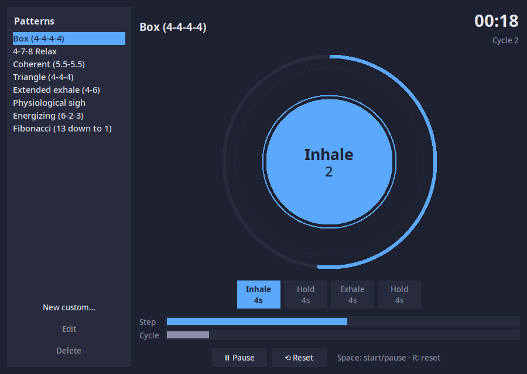

# Breathe

A minimal desktop app for guided breathing. Pick a pattern and follow the circle.



## Features

- Preset patterns: Box, 4-7-8, Coherent, Triangle, Extended exhale, Physiological sigh, Energizing, Fibonacci
- Custom patterns with any number of inhale / hold / exhale steps
- Animated circle, step countdown, session clock, and step and cycle progress bars

## Run

```sh
python3 breathing.py
```

Needs only Python 3 with Tkinter. **Space** starts or pauses, **R** resets.

Or double-click `Breathe.desktop` in a file manager like Thunar or Dolphin.

To install it as a `breathe` command with an app-launcher entry:

```sh
./install.sh                # per-user, into ~/.local
./install.sh --uninstall
```

Custom patterns are saved to `~/.config/breathing/patterns.json`.
